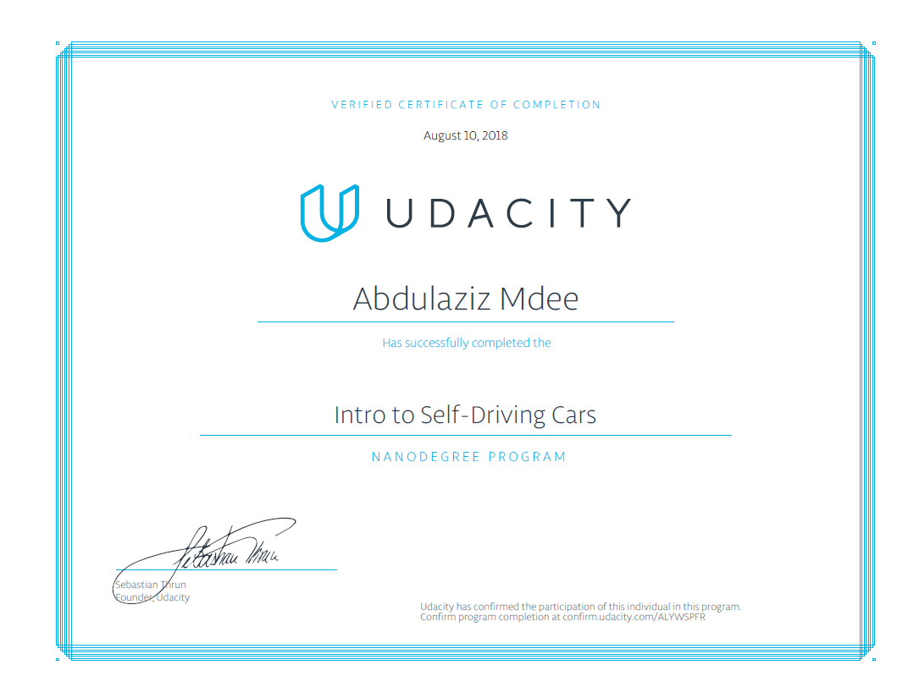

# [Intro to Self-Driving Cars](https://www.udacity.com/course/intro-to-self-driving-cars--nd113)

---

## About

This repisitory contains all my projects for [Intro to Self-Driving Cars](https://www.udacity.com/course/intro-to-self-driving-cars--nd113).

## Projects

* [Project 1: Joy Ride](#Joy-Ride)
* [Project 2: Implement a Matrix Class](#Implement-a-Matrix-Class)
* [Project 3: Translate Python to C++](#Translate-Python-to-C++)
* [Project 4: Implement Route Planner](#Implement-Route-Planner)
* [Project 5: Traffic Light Classifier](#Traffic-Light-Classifier)